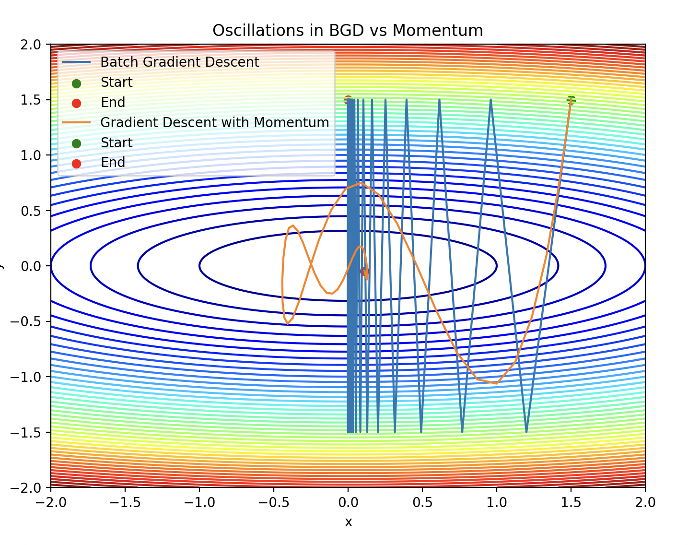

# AI-Optimizers

This project demonstrates and compares various gradient-based optimization algorithms including:

- **Batch Gradient Descent (BGD)**
- **Stochastic Gradient Descent (SGD)**
- **Momentum-based Gradient Descent**
- **RMSProp**
- **Adam**

Each optimizer is implemented from scratch and tested on a simple quadratic loss function to visualize their optimization paths and loss curves.

---

## 📁 Project Structure

AI-Optimizers/
- images/ # Screenshots and plots
─ adam_gradient_descent.py # Adam optimizer implementation
- data_generator.py # Data generation utilities
- gradient_descent.py # Batch Gradient Descent
- momentum_based_gradient_descent.py# Momentum-based optimizer
- rms_prop_gradient_descent.py # RMSProp implementation
- stochastic_gradient_descent.py # Stochastic Gradient Descent
- main.py # Main script to run and visualize optimizers
- README.md
---



---

## 🚀 Getting Started

### 1. Set up the environment

```
python3 -m venv venv
source venv/bin/activate
pip install numpy matplotlib
```
2. Run the main script
python main.py
This will generate:

Contour plots showing optimizer paths

Loss vs Epoch plots for each method

🖼️ Visual Examples
Optimization Paths

Loss Curves

⚙️ Optimizers Overview
Optimizer	Description
BGD	Uses the full dataset to compute gradients at each step
SGD	Updates weights based on a single data point per iteration
Momentum	Adds velocity to updates, helping accelerate convergence
RMSProp	Adjusts learning rate dynamically using a moving average of squared gradients
Adam	Combines Momentum and RMSProp for efficient, adaptive updates

✅ Features
Pure NumPy implementation (no ML frameworks)

Modular design — each optimizer in a separate file

Visualizations for optimization trajectory and loss curves

Easily extendable with new optimizers

📌 Future Improvements
 Add Nesterov Accelerated Gradient

 Include Adagrad and Adadelta

 Support for non-convex loss functions

 Add CLI arguments for hyperparameter tuning

📝 License
This project is licensed under the MIT License.
Feel free to use, modify, and distribute it.

